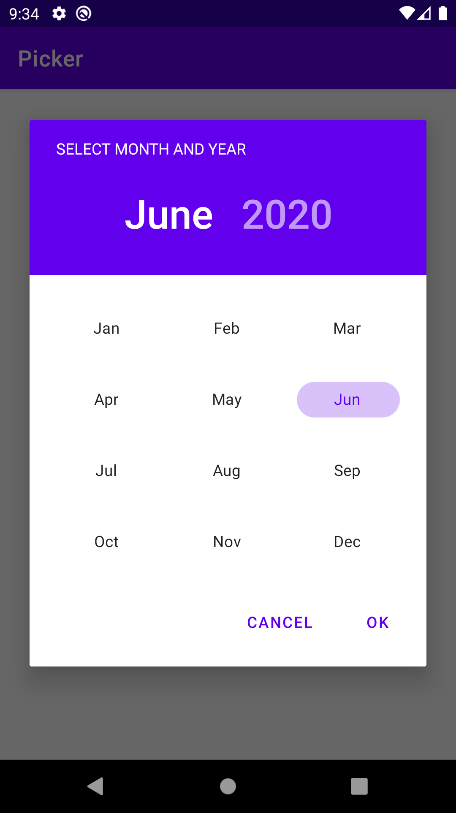
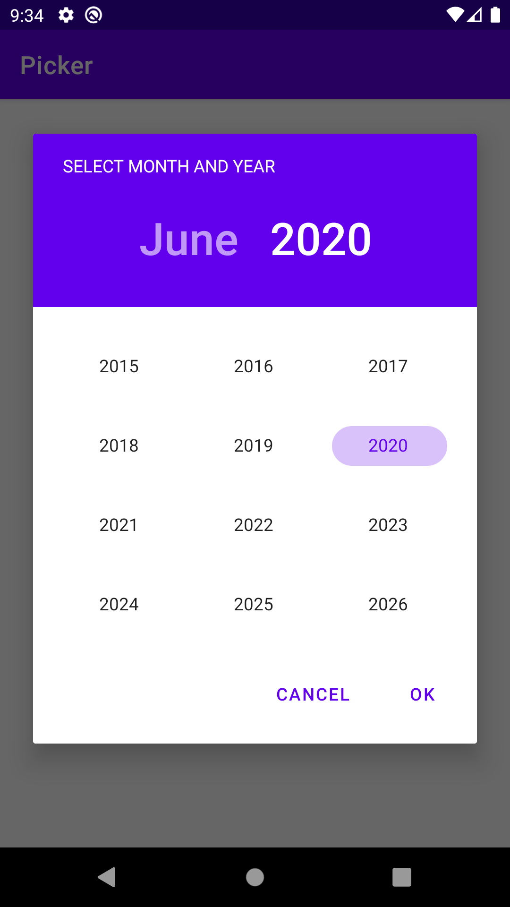

# Month-Year Picker
## About

This is a library to open a picker with month and year view. You can pick any month and year from 
picker and you will receive a calender instance from where you can fetch selected month year.

## Preview




## Setup
Use the following step to use this library.
You can download a jar from GitHub's [releases page](https://github.com/Dibyendu91/MonthYearPicker/releases).

Or use Gradle:
```gradle
repositories {
        google()
        jcenter()
    }

dependencies {
  implementation 'com.dibyendu.picker:picker:1.0.0'
  implementation "com.google.android.material:material:${material_version}"
}

buildFeatures {
        viewBinding = true
    }
```
Or use Maven:
```maven
<dependency>
  <groupId>com.dibyendu.picker</groupId>
  <artifactId>picker</artifactId>
  <version>1.0.0</version>
  <type>pom</type>
</dependency>
```

## Usage

```kotlin
import com.dibyendu.picker.util.PickerUtils
import com.dibyendu.picker.view.MonthYearPickerDialog
import com.dibyendu.picker.listener.PickerListener

MonthYearPickerDialog.show(context = this, calendar = calendar, listener = object : PickerListener {
                override fun onSetResult(calendar: Calendar) {
                    mCalendar = calendar
                    val date: String = PickerUtils.getMonthYearDisplay(
                        this@Activity,
                        calendar,
                        PickerUtils.Format.SHORT
                    )
                }
            })
```
### Attributes
#### Classes
* **MonthYearPickerDialog**: Use this class name to inflate the picker view
* **PickerUtils**: Use this class reference to access all utils properties to display selected month 
* **PickerListener**: Use this listener to get result after month year selection from picker.
* **Format**: Use this enum to get month name format as given input. Two types of format available.
    1. **LONG**: This type will provide full name format.
    1. **SHORT**: This type will provide short name format.

year in simple text. 

#### Methods
* **show(context: Activity, calendar: Calendar, listener: PickerListener)**: Use this method to open 
the picker view. You have to pass these given parameters to access the view.
    1. **context**: Activity context. 
    1. **calendar**: Calendar instance. It is an optional parameter. If you don't provide calendar 
    instance of your own, it will take current calendar date time by default.
    1. **listener**: Need to implement PickerListener.
* **getMonthYearDisplay(context: Context, calendar: Calendar, format: Format)**: Use this method to
get month display name as given format.
    1. **context**: Application context.
    1. **calendar**: Calendar instance.
    1. **format**: Format type. It is an optional parameter. If you don't provide any format, by 
    default it will take `LONG` format.
* **getMonth(calendar: Calendar, format: Format)**: Use this method to get only selected month from 
picker. 
     1. **calendar**: Calendar instance.
     1. **format**: Format type. It is an optional parameter. If you don't provide any format, by 
     default it will take `LONG` format.
* **getYear(calendar: Calendar)**: Use this method to get only selected year from picker.